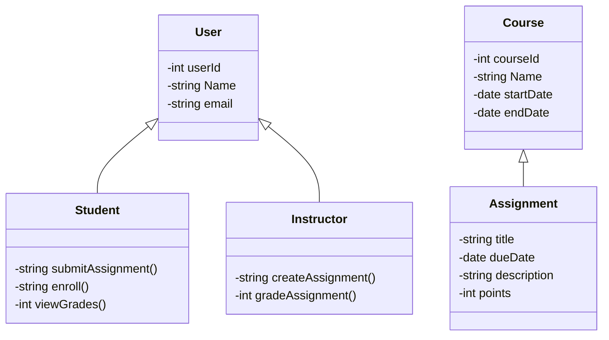

```mermaid
classDiagram
    User <|-- Student
    User <|-- Instructor
    Course <|-- Assignment
    
        class User{
          -int userId
          -string Name
          -string email
        }
    
        class Instructor{
          -string createAssignment()
          -int gradeAssignment()
        }
    
        class Student{
          -string submitAssignment()
          -string enroll()
          -int viewGrades()
        }
    
        class Course{
          -int courseId
          -string Name
          -date startDate
          -date endDate
        }
    
        class Assignment{
          -string title
          -date dueDate
          -string description
          -int points
        }
```
